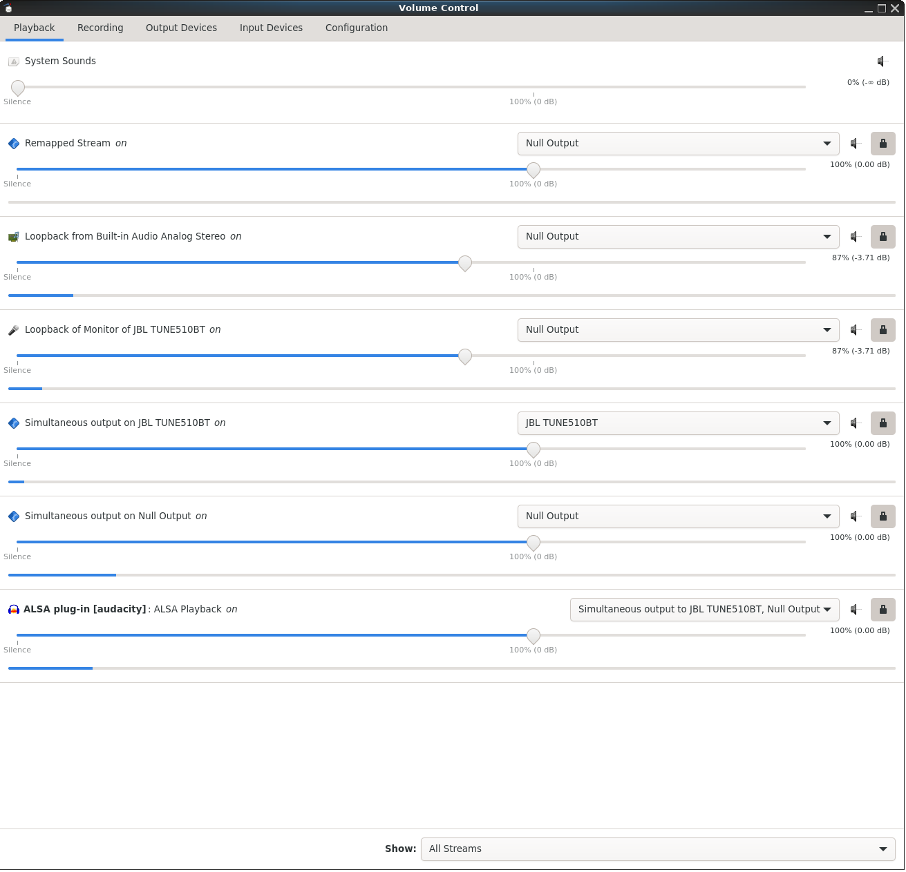

# pulseaudio_cast_helper.sh
Bash Script for creating virtual audio devices via pulseaudio/pavucontrol
for use in situations like these:
1. Recording audio (possibly with video too) locally.
1. Streaming to Discord, Twitch, Youtube, etc.

**This Bash script has only been tested on Linux running directly on an
x86-64 CPU.**
This means that this Bash script **has not** been tested on any
version of Windows Subsystem for Linux nor any other kind of Unix.

First run this command (with sample output shown) to find your desired sink
(speakers/headset):
```bash
$ pulseaudio_cast_helper.sh grep-list-sinks
    index: 0
	name: <alsa_output.hw_1_3>
  * index: 1
	name: <bluez_sink.C8_2B_6B_8F_50_ED.a2dp_sink>
```

For this guide, `name: <bluez_sink.C8_2B_6B_8F_50_ED.a2dp_sink>`
is chosen for the *physical* audio `sink`.

Next run this command (with sample output shown) to find your desired source
(microphone, capture card, etc)
```bash
$ pulseaudio_cast_helper.sh grep-list-sources
    index: 0
	name: <alsa_output.hw_1_3.monitor>
  * index: 1
	name: <alsa_input.pci-0000_00_1f.3.analog-stereo>
    index: 2
	name: <bluez_sink.C8_2B_6B_8F_50_ED.a2dp_sink.monitor>
```

For this guide, `name: <alsa_input.pci-0000_00_1f.3.analog-stereo>`
is chosen for the *physical* audio `source`.

Finally, run this command to create the virtual audio devices.
```bash
$ pulseaudio_cast_helper.sh create-merged-sink virt_sink bluez_sink.C8_2B_6B_8F_50_ED.a2dp_sink alsa_input.pci-0000_00_1f.3.analog-stereo
```

Next, in `pavucontrol`, set the "Playback" tab's contents (ignore the
"System Sounds" part) to be like the following screenshot:



Notes about this sample "Pavucontrol Playback Tab" screenshot:
* Any instance of the text "Built-in Audio Analog Stereo" should, on your
end, be set to the name of your microphone/other audio source. 
* Any instance of the text "JBL TUNE5120BT" should, on your end, be set to
the name of your speakers/headphones/other audio sink.
* **ALSA plug-in [audacity]** should be the name of whatever application
you want to record your (speakers/headset) audio from.

Also set the "Recording" tab's contents  to be like the following
screenshot:


Notes about this sample "Pavucontrol Recording Tab" screenshot:
* Any instance of the text "Built-in Audio Analog Stereo" should, on your
end, be set to the name of your microphone/other audio source.
* Any instance of the text "JBL TUNE5120BT" should, on your end, be set to
* **ALSA plug-in [audacity]** should be the name of whatever application
you want to send your desired audio to.
